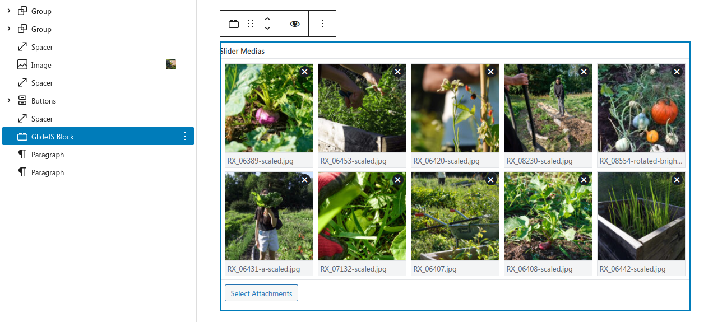

Experimental WordPress image carousel plugin using [GlideJS](https://glidejs.com/), [Carbon Fields](https://carbonfields.net/) and [Timber](https://upstatement.com/timber/).

Allows re-using Twig PHP template code in WordPress CMS side "Gutenberg Blocks" where each content block instance added to page maintains it's own data separately. User can also convert a single content block instance into a global "Pattern" which can sync/share data globally between Pattern instances, eg. across different pages or language versions.

Useful for backend devs, not requiring directly messing with the WP React Block API's, and those more familiar with Django, Laravel or Rails templating.

Block editor view:


Front end view:


Live demo at https://kasviklaani.fi/ front page.

# Installation

Clone repo into `wp-content/plugins/` and:
```
cd glidejs-cf-block
composer install
npm install
```

Enable plugin in WordPress and add block "GlideJS CF Block" in Gutenberg editor.

# TODO

It is quite hacky at the moment but should work for adding a single instance on the template...
Works on my computer at least, almost!

## Load GlideJS assets and initialize properly

- Currently loads scripts & styles for every block instance.
- Initialization won't work if block is used multiple times in same view.

## Evaluate Timber\render fn use
It does enqueue styles etc extra stuff, not necessarily correct function to render this.

Ref https://github.com/timber/timber/discussions/3035

## Correct Carbon Fields init in plugin context?

Does `\Carbon_Fields\Carbon_Fields::boot();` fail if called multiple times?


# Styles

Currently depends on some TailwindCSS classes from https://tailwind-lite.com/ which needs to be loaded separately to theme..

```
<link rel="stylesheet" href="https://cdn.tailwind-lite.com/1.0.2.css" />
```

Probably would be best to unstyle it before using as a generic block plugin. GlideJS also brings some of it's own style stuff of which some is required.
